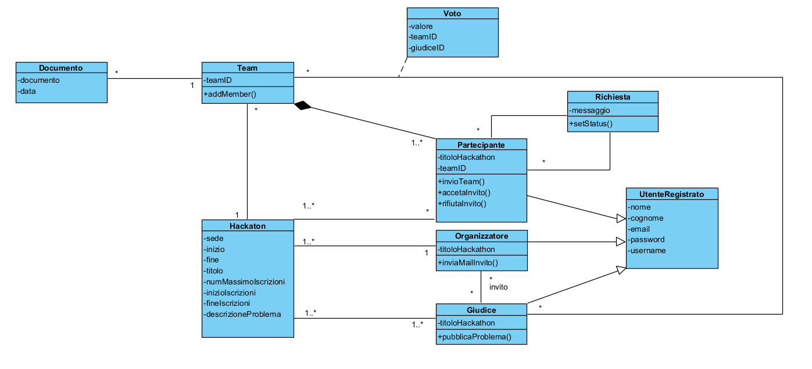

L'obiettivo di questo homework è la realizzazione di un diagramma delle classi che rappresenti un sistema di gestione per una piattaforma dedicata all’organizzazione di un hackathon, in cui utenti registrati possono partecipare a una competizione, formando team e lavorando insieme allo sviluppo di soluzioni innovative. Il diagramma è stato progettato per rappresentare in modo chiaro ed efficace le principali entità coinvolte e le relative attività all’interno della piattaforma, con un focus sui loro ruoli, sulle funzionalità chiave e sulla gestione completa dell’evento.

Per fare ciò, abbiamo realizzato un UML con le seguenti classi e la loro motivazione:

### Hackaton:

La classe Hackaton rappresenta tutti gli hackaton che sono svolti sulla piattaforma, a cui l'utente puo iscriversi, con un periodo di svolgimento (inizio e fine) e con un periodo di iscrizione.

Ha un titolo che lo identifica, un limite massimo di partecipanti ed e gestito da un organizzatore.

### UtenteRegistrato:

Rappresenta tutti gli utenti che si sono registrati alla piattaforma e che possono partecipare all' hackathon. È una classe fondamentale, dato che da essa derivano diversi ruoli come partecipante, organizzatore e giudice. Abbiamo deciso di realizzare questa classe come punto di partenza comune per tutti gli utenti nella piattaforma come: organizzatore, giudice e partecipante. Questa classe ha tutte le informazioni generiche degli utenti, ossia le credenziali d'acceso e i loro dati indentificativi (es: nome, username e password), e avrà modo di specializzarsi nelle tre sottoclassi sopracitate.

### Partecipante:

Rappresenta tutti gli utenti che prendono parte all’hackathon con il ruolo di partecipante. Questa specializzazione può creare dei Team e mandare i documenti con la possibile soluzione al problema fornito dai giudici.

Siccome è un’estensione di _UtenteRegistrato_, _Partecipante_ eredita tutti i metodi della classe generale, poiché ogni utente che partecipa deve essere prima registrato alla piattaforma e questo vuol dire che ogni metodo della classe _utenteRegistrato_ viene ereditato dalla classe _partecipante_. Inoltre, un partecipante può appartenere ad un team oppure unirsi successivamente tramite invito, e tale invito può essere inviato ad un altro partecipante, con la possibilità di accettare o meno la richiesta.

### Giudici:

Altra specializzazione della classe _UtenteRegistrato_. In questo caso il ruolo è quello di giudice, e tale ruolo permette di pubblicare il problema dell’evento e di dare giudizi e voti ai documenti dei partecipanti.

### Organizzatore:

L’organizzatore è l’ultima specializzazione di _UtenteRegistrato_ e si occupa scegliere i giudici tra gli utenti registrati alla piattaforma, mediante invito.

Oltre alla possibilità di invitare, è incaricato di aprire le registrazioni per potersi iscrivere all’Hackathon.

### Team:

Rappresenta un gruppo di partecipanti, che collaborano durante l'hackathon per risolvere il problema fornito dai giudici.

Ogni team ha un massimo di membri che possono comporlo e i vari team potranno inviare dei documenti, i quali verranno valutati con commenti e voti dai giudici dell'evento.

### Documento:

Il documento verrà creato dai team per i giudici e verrà aggiornato. Conterrà la possibile risoluzione al problema posto da giudici.

### Voto:

Il voto assegnato ad ogni team in base al documento finale è deciso dai giudici. il voto può essere in un range da 1 a 10 e il risultato delle votazioni finali verra decretata dalla somma dei voti dei tre giudici.

### Richiesta:

La richiesta può essere inviata solo da un partecipante già facente parte di un team non completo verso un altro partecipante.

Nell’invito dovrà includere un messaggio motivazionale per il possibile nuovo compagno (“possibile” perché la richiesta può essere anche rifiutata).

### UML

